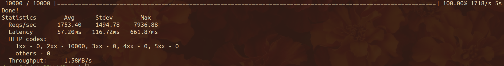
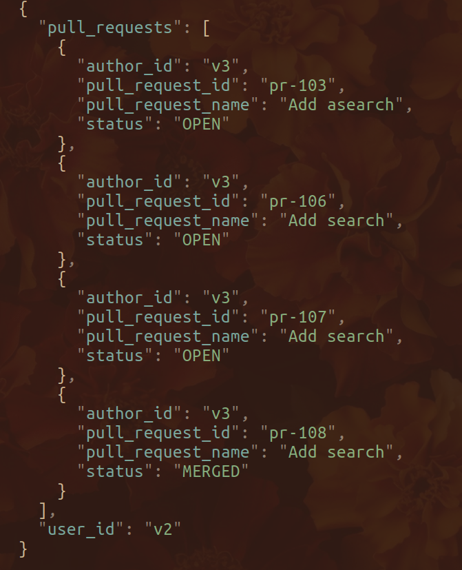

# avito-test

Тестовое задание на стажировку в avito

## Допущения

- Если при создании команды указываются несколько одинаковых участников, то они просто перезаписываются и добавляется лишь один
- Если у команды "забрали" всех участников, то она автоматически удаляется
- Везде где возвращается PullRequest возвращается createdAt, mergedAt
- Есле пользователь не найден в /users/getReview, то возвращается пустой массив с кодом 200(по openapi.yml)
- Много чего не успел из-за недостатка времени(тесты, метрики и пр). За 4 дня не успеть

## Что сделано

- Добавлены линтеры(govet находит скрытые баги в коде, unused находит неиспользованные объекты, а gofumpt форматирует код)
- Просто нагрузочное тестирование выдает не более 200мс avg
  
  

## Setup

_**Тестировалось на Linux**_

- Перед первым запуском необходимо выполнить `make setup`
- Для последующих запусков `make docker-run`

## Использование

- Будет доступно на порту `:8080`
